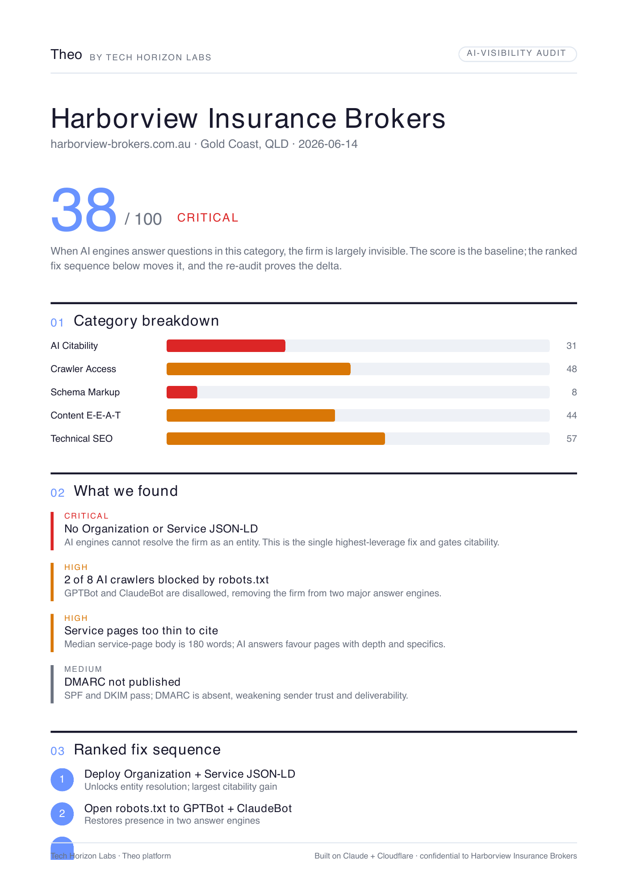
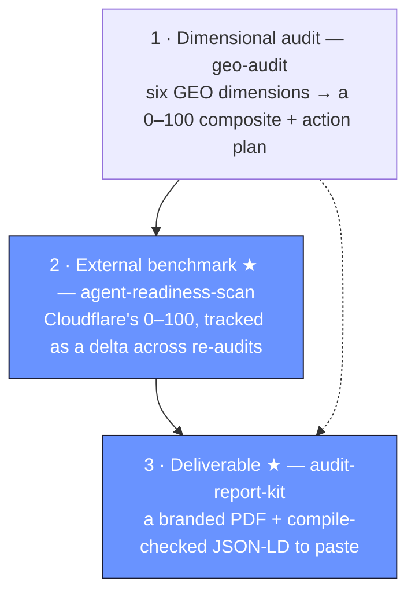

<div align="center">

# THL Open

### AI-visibility engineering, the open way

The open layer of how [**Tech Horizon Labs**](https://techhorizonlabs.com) runs GEO / AI-visibility audits — a Claude Code skill suite, two original tools, and the **method** that ties them together.

[](LICENSE)
[](https://claude.com/claude-code)
[](docs/THL-GEO-METHOD.md)
[](CONTRIBUTING.md)

<br>

### ⚡ [Are you found by AI? &nbsp;— run the free 60-second scan →](https://areyoufoundbyai.com)

<sub>The method in this repo, automated. Enter your URL, get your AI-visibility score across ChatGPT · Claude · Perplexity · Google AI — no install, no Claude Code, just the answer.</sub>

<br>



<em>A client-ready audit — composite score, evidence-backed findings, ranked fixes — produced by <a href="tools/audit-report-kit"><code>audit-report-kit</code></a> in this repo. (Sample data is fictional.)</em>

</div>

---

> **Search is splitting in two.** A growing share of your future customers will never click a blue link — they'll get an answer straight from ChatGPT, Claude, Perplexity, or Google's AI Overview. **GEO — Generative Engine Optimization — is how you stay inside that answer.** This repo is how we measure it, engineer it, and prove the movement.

We're an Australian AI-visibility agency. This is the *open* layer of our practice: the method we actually use on client work, the tools we built ourselves, and our improvements to the open-source GEO suite we build on. The calibration data, client playbooks, and full engagement pack stay proprietary — but the method and the utilities are here, for free.

---

## Three ways to get found by AI

Same method, three depths — start wherever you are:

| | | |
|---|---|---|
| **⚡ Instant** | **[areyoufoundbyai.com](https://areyoufoundbyai.com)** | Enter your URL → your AI-visibility score in ~60 seconds. Free, hosted, nothing to install. This is the method below, automated. |
| **🛠 Do it yourself** | **this repo** | Run the full six-dimension audit in Claude Code — the same method, all the evidence, none of the black box. |
| **🤝 Done for you** | **[Tech Horizon Labs](https://techhorizonlabs.com)** | We deploy it on your stack, with the calibration data and client playbooks that stay proprietary. |

---

## The method (start here)

Everything in this repo is organised around one opinionated workflow — **[the THL GEO Method](docs/THL-GEO-METHOD.md)**. Three layers, each answering a different question:



<div align="center"><sub>★ = built by THL, end to end</sub></div>

The discipline that makes it repeatable: **every score traces to evidence, the composite is a fixed formula, and you verify the artifacts — not that "a run happened."** Full write-up in [`docs/THL-GEO-METHOD.md`](docs/THL-GEO-METHOD.md); the run-time QA lives in the [audit checklist](skills/geo-audit/references/thl-audit-checklist.md).

---

## What's inside

### ★ Built by THL, end to end

| Component | What it does |
|---|---|
| **[`skills/agent-readiness-scan`](skills/agent-readiness-scan)** | Turns Cloudflare's public `isitagentready.com` check into audit-grade artifacts — a fixed-schema CSV, the 0–100 score, and the evidence behind it. The independent benchmark the dimensional audit can't give itself. |
| **[`tools/audit-report-kit`](tools/audit-report-kit)** | Turns an audit's JSON into a polished, branded **client PDF** (`react-pdf`) plus compile-checked **JSON-LD** (`schema-dts`) — the schema the audit recommends, ready to paste. *(That's the report pictured above.)* |
| **[`docs/THL-GEO-METHOD.md`](docs/THL-GEO-METHOD.md)** | The orchestration + scoring discipline above. |

### The GEO skill suite

A comprehensive set of Claude Code skills for Generative Engine Optimization — full audits, citability scoring, AI-crawler analysis, `llms.txt`, schema markup, brand-mention scanning, platform-specific optimization, technical SEO, content E-E-A-T, and report generation.

> **Honest attribution:** the `geo-*` skills are an **improved fork** of [`geo-seo-claude`](https://github.com/zubair-trabzada/geo-seo-claude) by **Zubair Trabzada** (MIT). We've de-rotted them, fixed portability, and wired them into our method and tools — but the foundation is his good open-source work, and we credit it. See [`NOTICE.md`](NOTICE.md) and [`CHANGELOG.md`](CHANGELOG.md). Improving and crediting open source *is* the standard we hold ourselves to.

---

## Quickstart

**As a Claude Code plugin (installs the whole suite).** Run these as **two separate
commands** — paste the first, press Enter, then paste the second (pasting both at once
makes Claude Code treat the blob as one broken `/plugin` call):

```text
/plugin marketplace add https://github.com/techhorizonlabs/thl-open
```

```text
/plugin install thl-open@thl-open
```

> Use the full `https://` URL — the short `owner/repo` form makes some setups clone via
> SSH and fail without an SSH key configured.

**Or copy just the skills you want:**

```bash
cp -R skills/agent-readiness-scan ~/.claude/skills/
cp -R skills/geo-audit skills/geo-crawlers skills/geo-schema ~/.claude/skills/
```

Then, in Claude Code:

```text
run an agent-readiness scan on example.com
do a GEO audit of example.com
```

**The report kit (Node):**

```bash
cd tools/audit-report-kit && npm install && npm run report   # → out/*.pdf + out/*.jsonld
```

👉 **New here? Start with [`examples/`](examples)** — copy-paste prompts for every
skill and one worked audit (fictional broker) you can read end to end.

---

## Learn more

- **[`examples/`](examples)** — prompts + a worked end-to-end audit.
- **[the THL GEO Method](docs/THL-GEO-METHOD.md)** — the three layers and the scoring discipline.
- **[Sources](docs/SOURCES.md)** — the primary research the method is grounded in, and what we *don't* claim.
- **[How THL Open compares](docs/HOW-WE-COMPARE.md)** — an honest look at the other GEO tools (and where they're ahead).
- **[Skill-Authoring Standard](docs/SKILL-AUTHORING-STANDARD.md)** — how we author skills, and the bar for PRs.
- **[`evals/`](evals)** — how we keep the audit repeatable.

> **Heads up:** skills can run code and fetch the open web. Read a skill before you
> install it, and treat fetched web content as data, not instructions. There's **no
> telemetry** — nothing here phones home ([`SECURITY.md`](SECURITY.md)). Our authoring
> standard bakes this in; we ask the same of contributions.

---

## Who's behind this

[**Tech Horizon Labs**](https://techhorizonlabs.com) is a Claude-native GTM + AI-visibility studio. We deploy this infrastructure for real clients — insurance brokers, professional-services firms, and scale-ups — on Cloudflare, into the workspace they already run. This repo is the part we can give away — and [**areyoufoundbyai.com**](https://areyoufoundbyai.com) is the method automated into a free scanner anyone can run in 60 seconds.

If it's useful, a ⭐ helps. Issues and PRs welcome — see [`CONTRIBUTING.md`](CONTRIBUTING.md).

## License

[MIT](LICENSE). The `geo-*` suite retains its original MIT notice (Zubair Trabzada) per [`skills/geo/LICENSE-geo-seo-claude`](skills/geo/LICENSE-geo-seo-claude); everything else is © Tech Horizon Labs. Use it, fork it, ship it.
