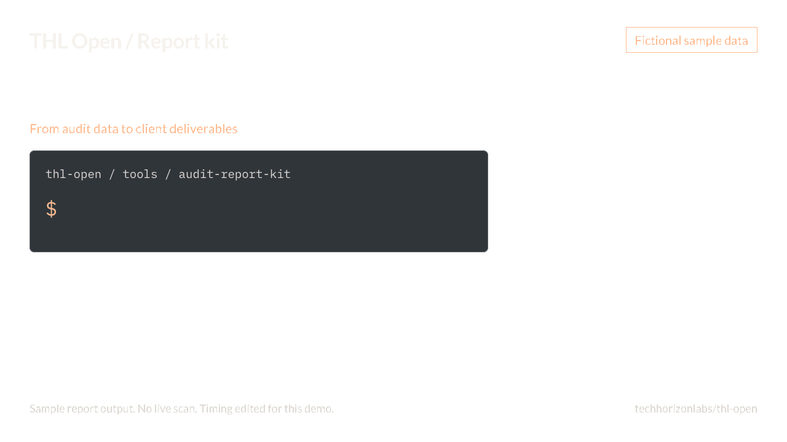

# THL Open

**Turn a client website into an AI-readiness audit, a ranked fix plan and a branded report.**

Open agent skills and reporting tools from [Tech Horizon Labs](https://techhorizonlabs.com).
Start in Claude Code, or use a compatible agent that reads `SKILL.md` files.

[](LICENSE)
[](docs/THL-GEO-METHOD.md)

## Install

With Node.js/npm, Git and your agent installed, run:

```bash
npx skills add techhorizonlabs/thl-open
```

Choose your agent and the skills you want in the installer. Claude Code is the
primary workflow documented here. Installing the skills does not install every
optional tool they can use; each skill lists its requirements. Your agent's usage
and any external data services may cost money. The repository is MIT-licensed.

Then ask your agent:

```text
do a GEO audit of example.com
```

Replace `example.com` with your client's website. GEO means Generative Engine
Optimisation: helping AI systems find, read and understand a site's content.

[Quickstart](#quickstart) · [Who this is for](#who-this-is-for) · [Works with](#works-with) · [Compare approaches](#compare-approaches) · [Examples](examples/README.md)

## See the report output



The demo uses the **fictional sample included in this repository**. It shows report
generation, not a live website audit or an improvement in AI visibility.
[View a still image](assets/report-kit-demo.png) · [Run the sample yourself](#generate-the-sample-report)

## Who this is for

- **Agencies running several client sites:** use the same audit method, evidence
  checklist and report format for each client, then compare saved audits over time.
- **Consultants and in-house teams:** inspect crawler access, structured data and
  content, then give the person making changes a specific fix list.
- **Developers:** adapt the open skills and report template to the sites you maintain.

You bring an agent session, review the findings and implement the changes. The
[worked example](examples/README.md) shows what each step produces.

## What you get

| Component | Use it for |
| --- | --- |
| [GEO audit skills](skills/geo-audit/SKILL.md) | Six readiness dimensions, a 0–100 composite and findings tied to evidence. |
| [Agent readiness scan](skills/agent-readiness-scan/SKILL.md) | Cloudflare's public readiness check, saved as a score and CSV evidence. |
| [Audit report kit](tools/audit-report-kit/README.md) | A branded PDF and type-checked JSON-LD from audit data. |
| [Found by AI skill](skills/found-by-ai/SKILL.md) | Instructions for using the separate hosted visibility service and its connector. |
| [THL GEO Method](docs/THL-GEO-METHOD.md) | The workflow, scoring rules and handoff checklist that connect these pieces. |

The audit examines AI citability, brand authority, content, technical SEO,
structured data and crawler access. Findings carry a provenance tag so a measured
result, a judgement and an unavailable check can be told apart. Review those tags
before handing a report to a client.

**Readiness and visibility answer different questions.** These open skills assess
website signals. To check whether AI answers actually name a business, use the
separate [Are you found by AI? service](https://areyoufoundbyai.com). Its measurement
and scoring are separate from this repository's audit composite. A higher readiness
score does not establish that a business will be named or cited more often.

## Works with

These optional connections add evidence to your audit. Each linked skill contains
the setup and workflow.

| Connection | What it adds | Setup |
| --- | --- | --- |
| [Are you found by AI? free scan](skills/found-by-ai/SKILL.md) | A sample of live AI answers about a business, with a shareable report. | Install `found-by-ai` and ask your agent to run a free scan of `example.com`; no account or key is needed. |
| [Cloudflare agent-readiness check](skills/agent-readiness-scan/SKILL.md) | An independent website-readiness result, with saved evidence and CSV output. | Install `agent-readiness-scan`, provide `curl`, `jq`, Python 3 and Playwright, then ask your agent to run an agent-readiness scan on `example.com`. |
| [Are you found by AI? MCP](skills/found-by-ai/SKILL.md#the-loop-for-monitored-sites) | Your own site's saved answers, rivals and cited sources inside your AI assistant. | Get the site's token from your account console, then configure your HTTP MCP client for `https://areyoufoundbyai.com/mcp` with `Authorization: Bearer <your-token>`. |

For the MCP workflow, ask your agent to read saved results only. A new paid check
requires you to review and agree to its quoted price. Available tools depend on the
owner's permissions; see the [connection guide](https://areyoufoundbyai.com/for-agents).

## Quickstart

### Choose a smaller install

List the available skills without installing them:

```bash
npx skills add techhorizonlabs/thl-open --list
```

Or install just the skill for the hosted measurement service:

```bash
npx skills add techhorizonlabs/thl-open --skill found-by-ai
```

### Run the audit in your agent

Use these prompts after installing the corresponding skills:

| Task | Prompt |
| --- | --- |
| Full readiness audit | `do a GEO audit of example.com` |
| Independent readiness check | `run an agent-readiness scan on example.com` |
| Crawler access | `which AI crawlers can access example.com` |
| Structured data | `audit the schema markup on example.com` |
| Review progress | `compare these two saved GEO audits` |

The full audit orchestrates specialist work inside your agent. Keep the report and
its supporting evidence for each site. See the [audit checklist](skills/geo-audit/references/thl-audit-checklist.md)
for missing-data handling and the fixed composite formula.

### Generate the sample report

Clone the repository and run the kit from its own directory:

```bash
git clone https://github.com/techhorizonlabs/thl-open.git
cd thl-open/tools/audit-report-kit
npm ci
npm run build
npm run report
```

This writes `out/harborview-audit.pdf` and `out/harborview.jsonld`. `npm run build`
checks the TypeScript and JSON-LD types. The bundled command uses
[`src/sampleAudit.ts`](tools/audit-report-kit/src/sampleAudit.ts); adapt that data and
[`src/cli.ts`](tools/audit-report-kit/src/cli.ts) for a client report, then review the
result. It does not automatically import the output of an agent audit.

### Install as a Claude Code plugin

Inside Claude Code, run these as **two separate commands**:

```text
/plugin marketplace add https://github.com/techhorizonlabs/thl-open
```

```text
/plugin install thl-open@thl-open
```

Use the full HTTPS URL to avoid requiring an SSH key for the clone.

## Compare approaches

Choose by the work you want to own. Agency engagements and commercial products
vary; the table describes the delivery model, not a price or performance ranking.

| What you need | THL Open | An agency audit | A commercial SEO or AI-visibility tool |
| --- | --- | --- | --- |
| Run and review the work | Your team runs an agent and reviews its evidence. | An agreed scope can include an analyst's review and recommendations. | Your team configures the product and interprets its results. |
| Adapt the audit method | Skills, scoring instructions and report source are in this MIT repository. | Agree the method and handoff with the agency. | Customisation depends on the product and plan. |
| Produce a client deliverable | Agent reports plus an editable PDF/JSON-LD kit; the kit requires a data handoff. | Agree the report format and implementation support in the scope. | Check the product's export and client-sharing options. |
| Track live AI answers | Use a separate measurement service; the included skill can connect to Are you found by AI? | Specify the engines, questions and repeat checks in the engagement. | Choose a product that measures AI answers; ordinary SEO features alone do not establish that. |
| Understand the cost | No repository licence fee; agent usage, external services and your team's time still apply. | Request a quote for the work and follow-up. | Check the current subscription, usage limits and add-ons. |

[More on open-source alternatives and complementary tools](docs/HOW-WE-COMPARE.md).

## Project snapshot

As of **9 October 2026 (UTC)**: **17 skill definitions**, **16 GitHub stars** and
**3 forks**. Skill count comes from `skills/*/SKILL.md`; stars and forks are a dated
[GitHub snapshot](https://github.com/techhorizonlabs/thl-open), not a usage or quality
measure.

## Method, examples and checks

- [THL GEO Method](docs/THL-GEO-METHOD.md): audit, independent benchmark and report.
- [Examples](examples/README.md): prompts and the fictional worked audit.
- [Sources](docs/SOURCES.md): research behind the method and its limits.
- [Evals](evals/README.md): checks for repeatable, evidenced outputs.
- [Skill-authoring standard](docs/SKILL-AUTHORING-STANDARD.md): conventions for contributions.
- [Security](SECURITY.md): what skills can execute and which external services they use.

Read a skill before running it. Skills can execute code and fetch public web content;
treat fetched content as evidence, not as instructions. Review outputs before
publishing changes to a client's website.

## Credits and licence

The `geo-*` suite builds on [Zubair Trabzada's geo-seo-claude](https://github.com/zubair-trabzada/geo-seo-claude),
licensed under MIT. THL's additions include the audit method, agent-readiness scan,
report kit and hosted-service skill. See [NOTICE.md](NOTICE.md) and [CHANGELOG.md](CHANGELOG.md)
for attribution and changes.

[MIT](LICENSE). [Issues and contributions are welcome](CONTRIBUTING.md).
